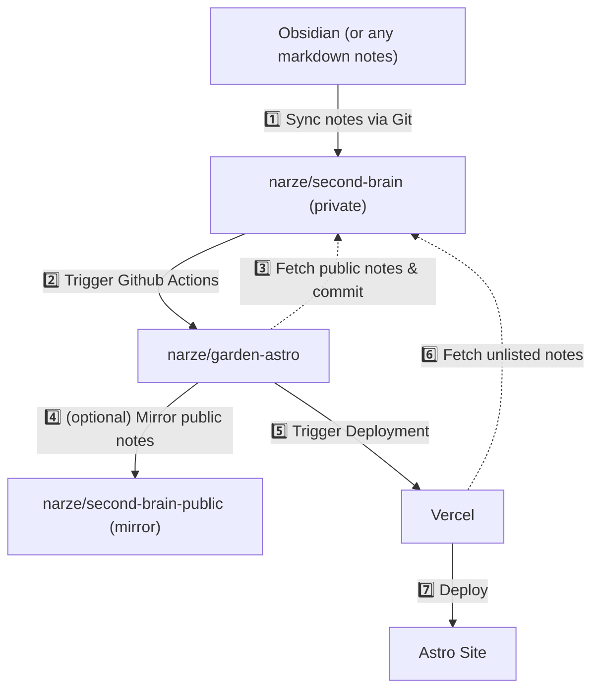

# Garden Astro

A Digital Garden generated with Astro. Allows editing on Obsidian and/or VSCode, sync with Git.

## Workflow



- Write notes in Obsidian app
  - To publish note, these fields must be added in frontmatter

    ```yaml
    publish: true
    date: YYYY-MM-DD
    title: "Title"
    slug: "custom-slug" # Optional
    ```

- Non-private notes will be synced to the GitHub repository [narze/second-brain](https://github.com/narze/second-brain) via the Obsidian Git plugin.
- Upon update, the [narze/second-brain](https://github.com/narze/second-brain) repository will trigger another repository [narze/garden-astro](https://github.com/narze/garden-astro) via GitHub Actions.
- The [narze/garden-astro](https://github.com/narze/garden-astro) repository will run another GitHub Actions workflow to fetch notes from [narze/second-brain](https://github.com/narze/second-brain), filter only the notes marked to be published, post-process them, and then commit the changes.
- Vercel then picks up committed changes and deploy to <https://garden.narze.live>

## Development

- `git clone https://github.com/narze/garden-astro`
- `pnpm install`
- `pnpm dev`

## Repository Fetching

This project supports fetching content from multiple GitHub repositories. You can configure which repositories to fetch from using environment variables or command-line parameters.

### Available Scripts

- `pnpm fetch` - Fetch from default repository (narze/second-brain)
- `pnpm fetch:local` - Fetch from local Obsidian vault
- `pnpm build` - Build the site (fetches from default repo with cleanup)
- `pnpm dev` - Start development server

### Environment Variables

- `REPOS` - Comma-separated list of repositories to fetch from
  - Example: `REPOS=narze/second-brain,narze/my-private-posts`

### Examples

```bash
# Fetch from multiple repositories
REPOS=narze/second-brain,narze/my-private-posts pnpm fetch

# Fetch from a single repository
pnpm fetch --repo=narze/second-brain

# Fetch from local Obsidian vault
pnpm fetch:local

# Build with cleanup (removes existing content first)
pnpm build
```
