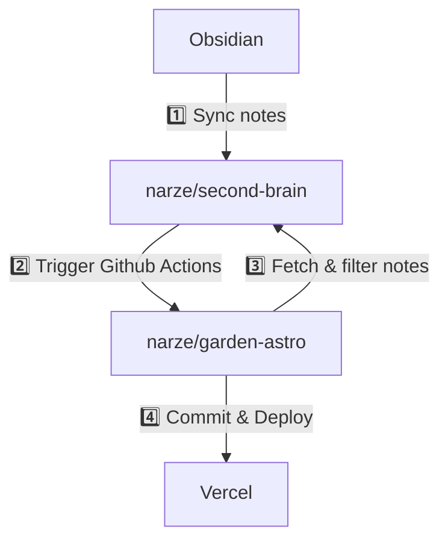

# Garden Astro

A Digital Garden generated with Astro. Allows editing on Obsidian and/or VSCode, sync with Git.

## Workflow



- Write notes in Obsidian app
  - To publish note, these fields must be added in frontmatter

    ```yaml
    publish: true
    date: YYYY-MM-DD
    title: "Title"
    slug: "custom-slug" # Optional
    ```

- Non-private notes will be synced to the GitHub repository [narze/second-brain](https://github.com/narze/second-brain) via the Obsidian Git plugin.
- Upon update, the [narze/second-brain](https://github.com/narze/second-brain) repository will trigger another repository [narze/garden-astro](https://github.com/narze/garden-astro) via GitHub Actions.
- The [narze/garden-astro](https://github.com/narze/garden-astro) repository will run another GitHub Actions workflow to fetch notes from [narze/second-brain](https://github.com/narze/second-brain), filter only the notes marked to be published, post-process them, and then commit the changes.
- Vercel then picks up committed changes and deploy to <https://garden.narze.live>

## Development

- `git clone https://github.com/narze/garden-astro`
- `pnpm install`
- `pnpm dev`
